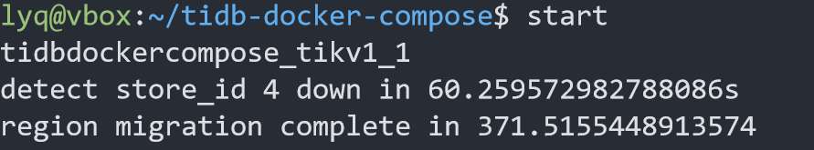

# 测试环境

3 pd

1 tidb

4 tikv // 当replica数 >= tikv节点数时，无法进行调度

max-store-down-time = “1m” // 加快pd判断tikv下线

# 系统要求

git

sysbench

mysql

python 3.x

// 可以单独创建一个测试发起docker，这样与tidb集群连接也方便很多，但是通知宿主机中的某个进程测试进度，由宿主进程来控制整体环境的启停。

# 核心逻辑

1. docker pause 模拟节点故障

2. pd-ctl 轮询 pd 查询故障store的状态

# 测试流程

1. 启动tidb集群

2. 准备数据

3. pause tikv0

4. pd-ctl 轮询 pd // pd0_addr 可以通过docker ps 获取， 暂时手写。

# 迁移过程

1. 最初判断store为down时，迁移过程并没有立马开始，而是等待了一段时间

2. 等待过后开始迁移

3. 迁移完后，store依然为down状态，没有标记为Tombstone状态

